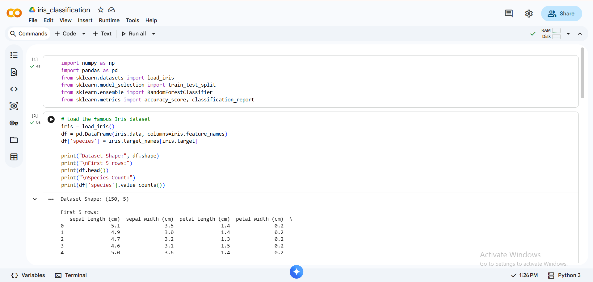
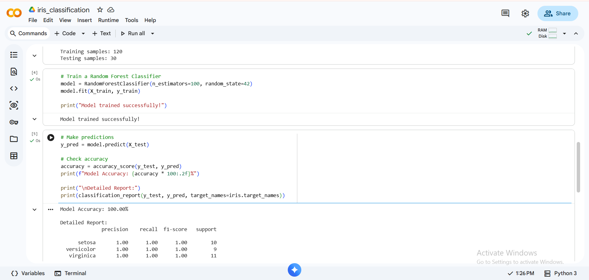
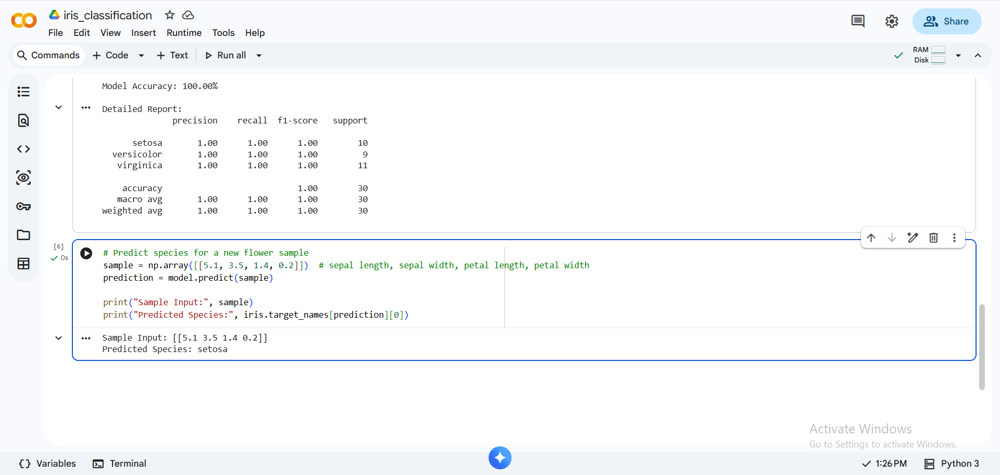

# 🌸 Iris Flower Classification

A machine learning project that classifies iris flower species using a Random Forest Classifier.

## 📊 Results
- **Model Accuracy: 100%** on test data
- Dataset: UCI Iris Dataset (150 samples, 3 species)

## 🛠️ Technologies Used
- Python
- NumPy
- Pandas
- Scikit-learn
- Google Colab

## 📌 What This Project Does
- Loads and explores the Iris dataset
- Splits data into 80% training / 20% testing
- Trains a Random Forest Classifier (100 trees)
- Evaluates using accuracy score and classification report
- Predicts species for new flower inputs

## 🔍 Key Concepts
- Supervised Learning
- Classification

## 📸 Output Screenshots

### Dataset Overview

### Train Test Split

### Model Accuracy

### Prediction Output

- Train-Test Split
- Model Evaluation (Precision, Recall, F1-Score)
